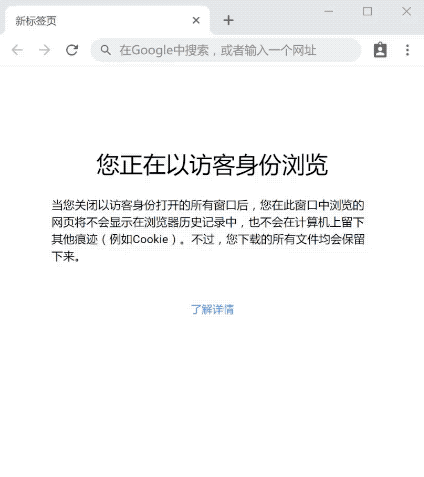

# chatbot4iexfinance
This is a project of AI12 program.
The chatbot can answer questions such as the price , volume and interest of stocks, by using natrue language. Something like:



```
User: hi
Bot : Yo. Bi-Bi-Bi. How are you. You can ask me for stock information, such as price, volume, interest.
User: i want to know something about the market
Bot : Which stock do you want to know?
User: what about AAPL today
Bot : AAPL'price is 150.85 now.
User: volume
Bot : Current volume of AAPL is 150.85.
User: the price of TSLA and GOOG, please.
Bot : The real-time price of TSLA is 342.38. GOOG'price is 1046.92 now.
```
 
The NLP engine of the chatbot is **Rasa NLU**
- [What is Rasa NLU?](http://rasa.com/products/rasa-stack/)

# Quick Install
Clone the project from github:
```
git clone https://github.com/yuminhao107/chatbot4iexfinance.git
```
Enter the directory:
```
cd chatbot4iexfinance
```
Install libraries:
```
pip install -r requirements.txt
```
Run the server in **web** mode:
```
python chatbot4iexfinance/main.py web
```
  (In order to visit the html page on your server, you should [configure your web server](#config-web-server) mannually.)

Or run the the server in **wechat** mode:
```
python chatbot4iexfinance/main.py wechat
```
After you run the server in **wechat** mode, you will be requried to scan a QC code in wechat. The current account in wechat will be used to act as the chatbot. You can talk to the chatbot now.

### Configure Web Server
In order to use the webpage from everywhere. You should first configure your web server.
If you are using **nginx**. Add the following block into your current config file.
```
location /chatbot {
    alias /path/to/chatbot4iexfinance;
    index index.html
    charset utf-8;
}
```
After that you can visit web page by the url:
```
http://yourdomain.com/chatbot
```

### Running the Tests
In order to run the tests make sure that you have the requirements installed. You can run:
```
python chatbot4iexfinance/main.py test
```
